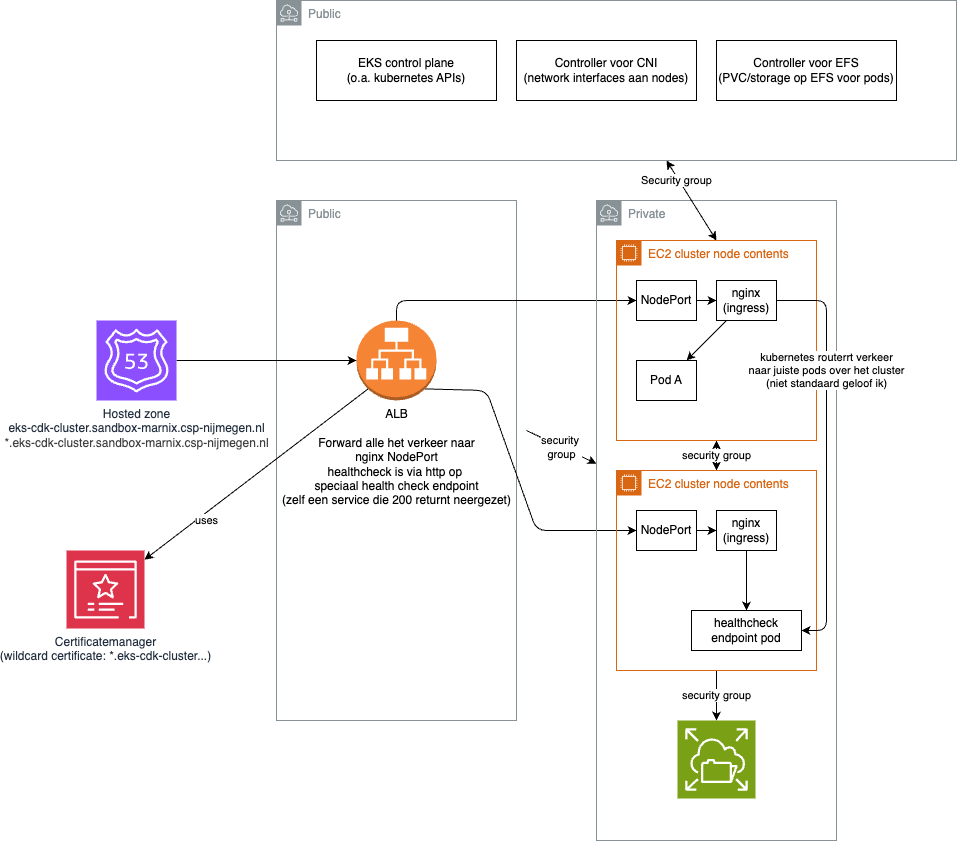

# First attempt at deploying a kubernetes cluster on EKS

- Uses nginx ingress controler (in-cluster) and a ALB oudside the cluster that forwards all traffic to EC2 nodes.
- Runs the 2048 game (deployed using a manifest)
- Uses EFS for provisioning ReadWriteMany Persistent Volume Claims (PVCs)

## Overview
